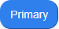
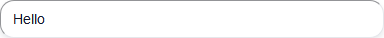
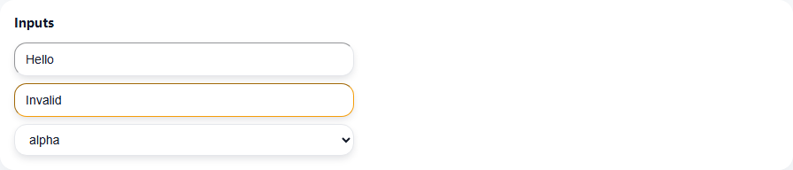

# Story 2.6: tailwind-migrate-batch1 (Epic E2)

Status: done

## Story
As a user, I need the highest-traffic UI elements restyled with Tailwind so the product looks modern while keeping behavior unchanged.

## Acceptance Criteria
1. Convert at least three shared components in `packages/ui` to Tailwind classes (button, card/tile, input or badge) with existing props preserved.
2. Pages using those components in `apps/web` are updated to the new styles with no layout break; workspace view is manually smoked.
3. Lightweight visual check exists: Storybook story, snapshot, or before/after screenshots attached to this story.
4. Lint and build remain green; bundle size delta noted.
5. Migration notes captured here (patterns to reuse, pitfalls).

## Tasks / Subtasks
- Identify target components and their import locations.
- Rebuild components with Tailwind utilities, referencing shared tokens.
- Replace usages in workspace screens to validate real layout.
- Add optional Storybook stories or screenshot diffs for the migrated components.
- Run `pnpm --recursive lint` and `pnpm --filter @cdm/web build`.

## Migration guide (short)
- Prefer composing utilities over heavy `@apply`; keep class lists readable.
- Keep spacing on token scale; reuse shared shadow/radius tokens.
- Use Tailwind variants for focus/hover/active; ensure focus ring is visible.
- Theme via CSS vars in Tailwind config to keep brand swap easy.
- Baseline: base components live in `packages/ui/src/components/*` and can be visually checked via `/?poc=uikit` (Playwright: `apps/web/tests/ui-kit.spec.ts`).

## Deliverables
- Updated components in `packages/ui` and their usages in `apps/web`.
- Visual evidence of the new look (story, snapshots, or screenshots).
- This file marked done with notes and links.

## DoR / Validation (2025-12-13)
- 目标组件：按钮、卡片/Tile、输入或 Badge（3 个以上），范围在 `packages/ui`，调用点在 `apps/web` 工作区界面。
- 依赖：2-5 已完成 Tailwind 配置与全局入口；token 种子可直接复用。
- 风险：局部样式冲突、bundle 体积小幅增加；回滚方案为保留旧组件并分支切换 class。
- 验收：需附视觉证据（Storybook/截图/快照），`pnpm --recursive lint` + `pnpm --filter @cdm/web build` 通过。
- Owner: 待分配（建议 bob）；Due: 2025-12-26；SP: 5（见 sprint-tasks-s1-jira.csv）。

## Implementation (2025-12-14)
- Shared components (Tailwind): `Button`, `Card`, `Input`, `Badge` in `packages/ui/src/components/*` (existing props preserved).
- Usage smoke (workspace): `apps/web/src/features/workspace/components/*` already uses `@cdm/ui` for toolbar/panels; verified via Playwright + build.

## Visual evidence (Playwright snapshots)
Generated by `apps/web/tests/ui-kit.spec.ts`:

## Verification (2025-12-14)
- `pnpm --recursive lint` ✅
- `pnpm --filter @cdm/web build` ✅
  - CSS gzip: 3.11 kB (Story 2-5 baseline: 2.74 kB) → +0.37 kB
  - JS gzip: 62.78 kB (Story 2-5 baseline: 58.83 kB) → +3.95 kB
- `pnpm --filter @cdm/web test -- ui-kit.spec.ts` ✅

## Migration notes
- Patterns to reuse
  - Keep variants/sizes as maps (e.g. `Record<ButtonVariant, string>`) + compose with `cx()` for readability.
  - Prefer tokenized Tailwind colors (`bg-surface`, `border-border`, `text-neutral-*`) over raw hex to keep theme swaps easy.
  - Always include visible focus states (`focus-visible:ring-*` + `ring-offset-2`) on interactive elements.
- Pitfalls / gotchas
  - Preflight is disabled: do not rely on browser default styles (set border/bg/padding/typography explicitly).
  - Snapshot filenames are platform-specific (`*-chromium-win32.png`); update snapshots per environment when needed.
